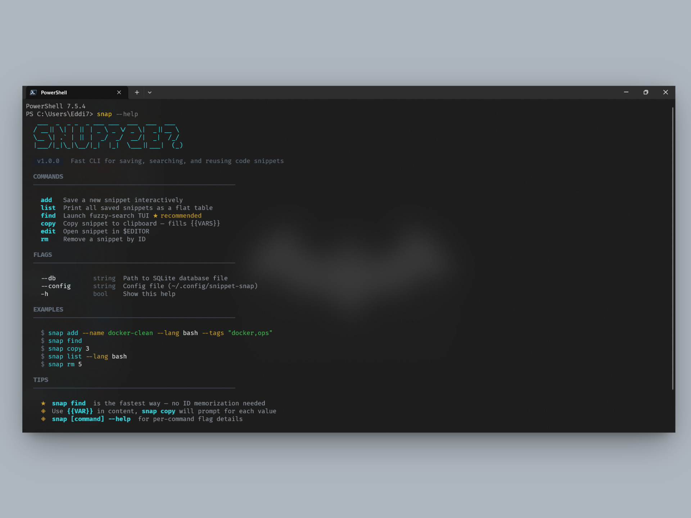

<div align="center">

```
  ◈ SNIPPET-SNAP
```


**Fast CLI tool for saving, searching, and reusing code snippets.**

[](https://go.dev)
[](LICENSE)
[]()

</div>

---

## Why Snippet-Snap?

You have dozens of one-liners, boilerplate blocks, and CLI commands scattered across Notion, Slack DMs, and random `.txt` files. **Snippet-Snap** puts them all in one place with:

- **Fuzzy search TUI** — find any snippet in milliseconds without leaving the terminal
- **Syntax highlighting** — preview code in 250+ languages right in terminal (powered by Chroma)
- **`{{VAR}}` injection** — save templates with placeholders, fill on paste
- **One-command copy** — straight to clipboard, no mouse needed
- **SQLite + FTS5** — full-text search over 1000+ snippets in <100ms
- **Single binary** — zero dependencies, works offline

---

## Install

> **Zero dependencies.** Single binary. Installs to PATH automatically.

### Homebrew (macOS / Linux)

```bash
brew install O-Aditya/tap/snippet-snap
```

### Scoop (Windows)

```powershell
scoop bucket add snippet-snap https://github.com/O-Aditya/scoop-bucket
scoop install snippet-snap
```

### One-liner script

```bash
# macOS / Linux — auto-detects shell, adds to PATH
curl -sSL https://raw.githubusercontent.com/O-Aditya/snippet-snap/main/scripts/install.sh | bash

# Windows (PowerShell) — no restart needed
irm https://raw.githubusercontent.com/O-Aditya/snippet-snap/main/scripts/install.ps1 | iex
```

### Via Go

```bash
go install github.com/O-Aditya/snippet-snap@latest
```

### Build from source

```bash
git clone https://github.com/O-Aditya/snippet-snap.git
cd snippet-snap
go build -o snap .
```

---

## Usage

### Save a snippet

```bash
# Pipe content in
echo 'docker system prune -af --volumes' | snap add --name docker-clean --lang bash --tags "docker,cleanup"

# Or open your editor
snap add --name my-snippet --lang python --tags "util"
```

### Search with fuzzy TUI

```bash
snap find
```

> **Layout:** side-by-side. Left = snippet list with language badges. Right = syntax-highlighted preview with tag badges. Full keyboard navigation.

| Key | Action |
|---|---|
| `↑` `↓` | Navigate list |
| `Enter` | Copy to clipboard |
| `Tab` | Toggle preview pane |
| `Esc` | Quit |

### List all snippets

```bash
snap list              # flat table with badges and relative timestamps
snap list --lang bash  # filter by language
snap list --tag docker # filter by tag
```

### Copy with variable injection

```bash
# Save a template with placeholders
echo 'ssh {{USER}}@{{HOST}} -p {{PORT}}' | snap add --name ssh-connect --lang bash --tags "ssh"

# When you copy, it prompts for each variable
snap copy 1
#   USER: root
#   HOST: 192.168.1.100
#   PORT: 22
# → clipboard: ssh root@192.168.1.100 -p 22
```

### Edit and delete

```bash
snap edit 1        # opens in $EDITOR
snap rm 1          # prompts for confirmation
snap rm 1 --force  # skip confirmation
```

---

## Design System

Snippet-Snap uses **Terminal-Native Noir** — respects your terminal background, adds color only where it earns its place.

**The 4 laws:**
1. **Default background is sacred** — never fills the full terminal width with color
2. **Borders create structure** — `│` dividers and `─` separators, not colored bars
3. **Three text brightness levels** — Bright / Normal / Dim, nothing else
4. **One accent color** — Cyan `#39D0D8`, used sparingly

Language badges are auto-colored per language family (bash=green, python=indigo, go=teal, sql=amber, yaml=purple, js=yellow).

---

## Configuration

Config file lives at `~/.config/snippet-snap/config.yaml`:

```yaml
# Path to the SQLite database
db_path: ~/.config/snippet-snap/snippets.db

# Preferred editor for snap add/edit
editor: code  # or vim, nano, notepad, etc.
```

Override with flags:

```bash
snap --db /path/to/custom.db list
snap --config /path/to/config.yaml add --name test
```

---

## Architecture

```
snap (CLI)
  ├── cmd/           Cobra commands (add, list, rm, edit, find, copy)
  ├── internal/
  │   ├── db/        SQLite + FTS5 (all SQL in queries.go)
  │   ├── tui/       Bubble Tea TUI (finder, styles, keymap)
  │   ├── inject/    {{VAR}} placeholder detection + prompt
  │   ├── clipboard/ Cross-platform clipboard (atotto)
  │   └── highlight/ Chroma syntax highlighting
  └── config/        Viper config loader
```

**Key rules:**
- `cmd/` never imports `database/sql` — always through `internal/db/queries.go`
- TUI receives `[]models.Snippet` — never queries the DB itself
- All SQL lives in one file: `internal/db/queries.go`
- All colors live in one file: `internal/tui/styles.go`

---

## Tech Stack

| Package | Role |
|---|---|
| [Cobra](https://github.com/spf13/cobra) | CLI command router |
| [Bubble Tea](https://github.com/charmbracelet/bubbletea) | TUI event loop |
| [Lip Gloss](https://github.com/charmbracelet/lipgloss) | Terminal styling |
| [Bubbles](https://github.com/charmbracelet/bubbles) | TUI components (textinput, viewport) |
| [modernc/sqlite](https://pkg.go.dev/modernc.org/sqlite) | Pure-Go SQLite driver |
| [Chroma](https://github.com/alecthomas/chroma) | Syntax highlighting |
| [clipboard](https://github.com/atotto/clipboard) | Cross-platform clipboard |
| [Viper](https://github.com/spf13/viper) | Config management |

---

## Contributing

1. Fork the repo
2. Create a feature branch (`git checkout -b feat/amazing-feature`)
3. Commit changes (`git commit -m 'Add amazing feature'`)
4. Push to branch (`git push origin feat/amazing-feature`)
5. Open a Pull Request

```bash
# Development
go build -o snap .
go test ./... -v
```

---

## License

MIT — see [LICENSE](LICENSE) for details.

---

<div align="center">

**Built with ◈ by [O-Aditya](https://github.com/O-Aditya)**

</div>
